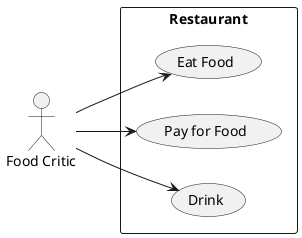

# Описание требований и архитектуры

## Введение
<!-- Общее краткое описание создаваемой системы -->
В рамках курса осуществляется проектирование решения на основе [постановки задачи от "заказчика"](../../task.md).

- [Описание требований и архитектуры](#описание-требований-и-архитектуры)
  - [Введение](#введение)
  - [Заинтересованные стороны](#заинтересованные-стороны)
  - [Бизнес-контекст (бизнес-требования)](#бизнес-контекст-бизнес-требования)
  - [Глоссарий](#глоссарий)
  - [Модель предметной области](#модель-предметной-области)
  - [Требования к системе](#требования-к-системе)
    - [Сценарии использования (Use case)](#сценарии-использования-use-case)
    - [Функциональные требования](#функциональные-требования)
    - [Нефункциональные требования/Требования к атрибутам качества](#нефункциональные-требованиятребования-к-атрибутам-качества)
    - [Ограничения](#ограничения)
  - [Архитектура](#архитектура)
    - [Журнал архитектурных решений](#журнал-архитектурных-решений)
    - [Контекст решения](#контекст-решения)
    - [Компонентная архитектура](#компонентная-архитектура)
    - [Реализация сценариев использования](#реализация-сценариев-использования)
    - [Программные интерфейсы](#программные-интерфейсы)
    - [Схема развертывания](#схема-развертывания)
  
## Заинтересованные стороны
<!-- Перечень заинтересованных сторон и их интересов по отношению к создаваемой системе. 
Подробнее: https://confluence.mts.ru/pages/viewpage.action?pageId=399975538 
-->
| Заинтересованная сторона | Интересы           |
|:-------------------------|:-------------------|
| *Название*               | *Список интересов* |
| Организация ПАО "МТС"    | Поддержание имиджа компании как высокотехнологичной IT             |
|                          | Повышение престижа работы в компании                               |
|                          | Формирование экспертного образа, повышение узнаваемости в среде профессионалов|
|| Организация площадки для поиска тенденций в современном ИТ. |
||Способствовать развитию научно-исследовательской и инновационной деятельности. |
| HR-отдел компании        | Привлечение внимания квалифицированных специалистов к компании                       |
|                          | Создание условий для мониторинга состава и квалификации участников |
|                          | Оценка размера и качественных показателей рынка труда в регионе    |
| Онлайн-участники         | Ознаковиться с новой информацией в IT в целом и в конкретном направлении  |
| Физические участники|Ознаковиться с новой информацией в IT в целом и в конкретном направлении, задать интересующие вопросы докладчикам, пообщаться с коллегами из разных компаний|
| Докладчики | Заявить о себе как об эксперте в своей области, повысить своб стоимость на рынке труда|
| Регулирующие госорганы   | Контроль за исполнением требований законодательства в области организации и безопасности проведения публичных мероприятий  |
| Учредители, акционеры    | Рост стоимости кампании за счёт роста позитивного имиджа, привлечения самых квалифицированных специалистов на рынке труда |

## Бизнес-контекст (бизнес-требования)
<!-- Общее описание бизнес-контекста создаваемой системы (автоматизируемой деятельности), список бизнес-целей заинтересованных сторон 
Подробнее: https://confluence.mts.ru/pages/viewpage.action?pageId=399973845
-->

1. На сайте системы доступна общая информация о научно-технических конференциях - направления и тематика конференций, ответы на часто задаваемые вопросы, а также контактную информацию об организации, проводящей конференции.
2. Сайт системы содержит перечень прошедших конференций с материалами этих пероприятий - список докладчиков, краткое описание докладов, тектовые варианты докладов и видео материалы докладов.
3. Для повышения взаимодействия с пользователями система имеет функционал, позволяющий проголосовать за лучшее выступление на прошедшей конференции и оставить в конце заявку на получение материалов мероприятия. Проголосовавший получит эти материалы на свою эл. почту.
4. Посетитель сайта видит анонс грядущих мероприятий.
5. Желающие участвовать в конференции в качестве слушателя может зарегистрироваться на анонсируемые мероприятия и указать формат участия - онлайн или физическое присутствие на конференции.
6. Желающие выступить на конференции с докладом может отправить заявку на эл. почту организации с темой доклада и своими контакными данными.
7. Желающий участвовать онлайн может смотреть трансляцию докладов на площадке, получив ссылку на трансляцию накануне мероприятия по эл. почте.
8. Желающий участвовать как физический слушатель получает информацию как попасть в на конференцию, а также имеет доступ к месту проведения мероприятия.
## Глоссарий
<!-- Содержит основные понятия и термины предметной области  
Подробнее: https://confluence.mts.ru/pages/viewpage.action?pageId=375782595
-->
| Понятие                        | Сокращение                         | Определение                       |
|:-------------------------------|:-----------------------------------|:----------------------------------|
| Конференция |  | Периодическое мероприятие на тему информационных технологий, проводимое ПАО МТС  |
| Посетитель сайта |  | Любой пользователь, открывший в браузере сайт |
| Пользователь сайта |  | Пользователь, зарегистрированный в системе |
| Онлайн-участник мерприятия |  | Зарегистрированный пользователь, получивший ссылку-приглашение на мероприятие |
| Физический участник мероприятия |  | Пользователь, зарегистрированный в системе, получивший приглашение на физическое посещение мероприятия и прибывший на место проведения конференции |
| Сотрудник-организатор |  | Оодин из сотрудников ПАО МТС, товетственных за организацию мероприятий |
| Расписание мероприятий |  | Список проведённых и планируемых конференций |
| Трансляция |  | Онлайн-видеотранслирование собьытий конференции на сайте системы |
| Докладчик |  | Пользователь системы, заблаговременно подавший заявку на участие в конференции в качестве докладчика |
| Докладчик-победитель |  | Докладчик, признаный лучшим на конкреной конференции по результатам голосования участников-слушателей |

## [Модель предметной области](data/data.md)

## Требования к системе

### Сценарии использования (Use case)
<!-- Подробное описание сценариев использования системы с привязкой к ролям участников и задействованным бизнес-сущностям 
https://confluence.mts.ru/pages/viewpage.action?pageId=375782108 
https://confluence.mts.ru/pages/viewpage.action?pageId=375782119 
-->
#### Диаграмма сценариев использования (Use Case Diagram) <!-- omit in toc -->

#### Список сценариев использования <!-- omit in toc -->

| ID     | Описание                                          |
|--------|---------------------------------------------------|
| UC.001 | *[Название сценария использования](uc/uc.001.md)* |

### Функциональные требования
<!-- Описание требований к функциям, реализуемым системой. Требование может быть привязано к сценарию использования или быть общим 
Подробнее: https://confluence.mts.ru/pages/viewpage.action?pageId=375782501 
-->
| ID     | Функциональное требование             |
|--------|---------------------------------------|
| FR.001 | Система должна позволять пользователю зарегистрироваться |
| FR.002 | Система должна позволять пользователю просматривать материалы прошедших мероприятий|
| FR.003 | Система должна позволять пользователю после логина направлять свои данные в качестве заявки на участие в конференции в качестве онлайн-слушателя, физического слушателя или докладчика и присылать ему приглашение |
| FR.004 | Система должна позволять сотрудникам ПАО МТС, ответственным за организацию конференций размещать анонсы будущих мероприятий, материалы прошедших конференций, а также проводить информационные рассылки зарегистрированным пользователям|
| FR.005 | Система должна позволять пользователю, который получил ссылку-приглашение на онлайн-просмотр, перейти по ссылке и подключаться к онлайн-трансляции во время проведения конференции |
| FR.006 | Система должна позволять пользователю проголосовать за лучшего докладчика после завершения конференции |
| FR.007 | СИстема должна позволять сотруднику ПАО МТС, ответственному за проведение конференций просматривать результаты голосований и публиковать на сайте имя докладчика-победителя |

### Нефункциональные требования/Требования к атрибутам качества
<!-- Требования к основным архитектурным характеристикам (атрибутам качества) системы - надежность, масштабируемость, ИБ, и др.
Подробнее: https://confluence.mts.ru/pages/viewpage.action?pageId=375782530
-->
| ID     | Атрибут качества             | Описание требования                       |
|--------|------------------------------|-------------------------------------------|
| QR.001 | Информационная безопасность | Система должна соответсвовать требованиям, установленными стандартами компании ПАО МТС (приложить перечень ссылок к документам) |
| QR.002 | Сайт системы должен предоставлять доступ к контактам, норматифным документа, положениям деловой этики, а также справочной информации (FAQ) на каждой странице сайта|
| QR.003 | Система должна выполнять свои функции и не прерывать проводимые трансляции в пиковые моменты нагрузки (10000 пользователей одновременно)|
| QR.004 | Системв должна поддерживать резервирование для предотвращения потери данных о мероприятиях и докладчиках |
| QR.005 | Системв должна поддерживать поддерживать работу в наиболее популярных современных браузерах на базе Chrome/Chromium |
| QR.006 | Язык предоставление информации - русский. |
| QR.007 | Система должна предусматривать возможность расширения количества одновременных посетителей до 100000 человек. |
| QR.008 | Срок поставки функционала системы - 9 месяцев с момента утвержения требований |

### Ограничения
<!-- Описываются ограничения, оказывающие влияние на архитектуру системы - временные, финансовые, технологические
Подробнее: https://confluence.mts.ru/pages/viewpage.action?pageId=375782592
-->
| ID     | Ограничение            |
|--------|------------------------|
| AC.001 | ПО, используемое для построение системы должно быть OpenSource c лицензией, допускающее безвозмездное использование либо принадлежать ПАО МТС |

## Архитектура

### Журнал архитектурных решений
<!-- Записи о ключевых принятых архитектурных решениях (ADR) для реализации архитектурно-значимых требований.
Подробнее: https://confluence.mts.ru/pages/viewpage.action?pageId=421162308
-->
- [ADR.NNN Суть решения](adr/adr-template.md)

### [Контекст решения](context/context.md)

### [Компонентная архитектура](components/components.md)

### Реализация сценариев использования
<!-- Реализация сценариев использования на основе взаимодействия компонентов системы и внешних систем/участников.
Диаграммы последовательности (UML Sequence diagram) и текстовое описание.

Подробнее: 
https://confluence.mts.ru/pages/viewpage.action?pageId=399442132
https://confluence.mts.ru/pages/viewpage.action?pageId=399442170
-->
| ID     | Описание                          | Реализация                                    |
|--------|-----------------------------------|-----------------------------------------------|
| UC.001 | *Название сценария использования* | [Реализация сценария](uc-impl/uc.001-impl.md) |

### Программные интерфейсы
<!-- Спецификации публичных API системы и ее компонентов (синхронных, событийных). Создается на основе модели предметной области для реализации сценариев использования. 
  Форматы: OAS/Swagger, GraphQL, AsyncAPI/CloudEvents
-->
| Компонент             | Интерфейс                                      |
|:----------------------|:-----------------------------------------------|
| *Название компонента* | *[Название интерфейса](api/service-name.yaml)* |

### [Схема развертывания](deployment/deployment.md)
